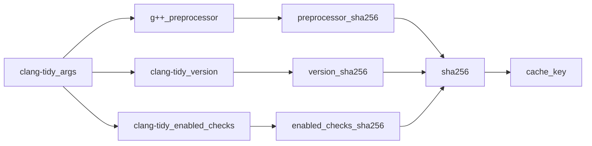

# cltcache -- A python3 clang-tidy cache

A simple cache which can cache clang-tidy static code analysis results to speed up the build process in large messy codebases.
cltcache is like ccache but for clang-tidy static code analysis results.

## Usage

Install using pip

```
pip3 install cltcache
```

Prefix all of your clang-tidy calls with cltcache in your build system or configuration.

```
set(CMAKE_C_CLANG_TIDY "cltcache" "${CLANG_TIDY_PROGRAM}")
set(CMAKE_CXX_CLANG_TIDY "cltcache" "${CLANG_TIDY_PROGRAM}")
```

```
cmake -DCLANG_TIDY_PROGRAM="cltcache /usr/bin/clang-tidy" ..
```

Finally you have to manually manage your cache which is stored in `~/.cltcache`.
If you are using cltcache in CI you need to distribute the cache between builders.
If you are using cltcache locally you will need to manually manage your cltcache because it will grow indefinately.
Here is a useful command which should remove all cache entries older than 60 days:

```
find ~/.cltcache -mtime +60 | xargs rm
```

For reasonable clang-tidy usage, the cache should be so small, that you will not need to clean it until you upgrade your computer.
Check the disk usage of the cache using this command:

```
du -hd0 ~/.cltcache
```

## Why?

Static code analysis of C++ code can consume more time and power than compilation while producing a lot smaller output files, especially when no warnings and errors were generated.
The output is also basically never consumed by a customer, which means it is not as important to ensure the correctness of the cache.
For these reasons static code analysis should be a much better match for caching than compilation is.
Because clang-tidy is probably used in tons of CI-pipelines around the world, it should be possible to save tons of energy by caching the results.

## How?

The cache key is generated by computing a sha256-hash of the gcc preprocessor results, the enabled clang-tidy checks and the clang-tidy version string.



## Caveats

### Correctness

cltcache assumes that identical preprocessor output, clang-tidy version and enabled checks will produce identical results, which is not a guarantee.
One such case is if a filtered header is moved to a path where its warnings and errors would no longer be filtered.
If you are concerned about this, you should probably reconsider your priorities.
Relying upon clang-tidy to the point where its correctness is more important than time, money and the environment, is rarely a sustainable strategy.

### Ouptut order

The order of stdout and stderr is not preserved.
The stdout of clang-tidy is printed first and the stderr is printed last.
